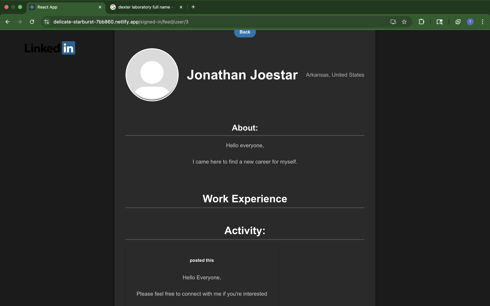
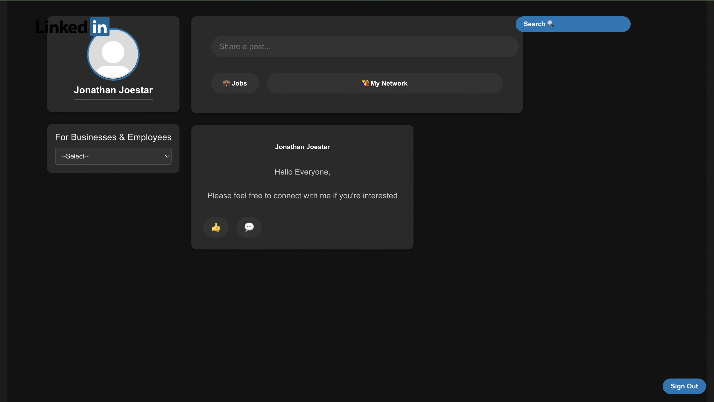
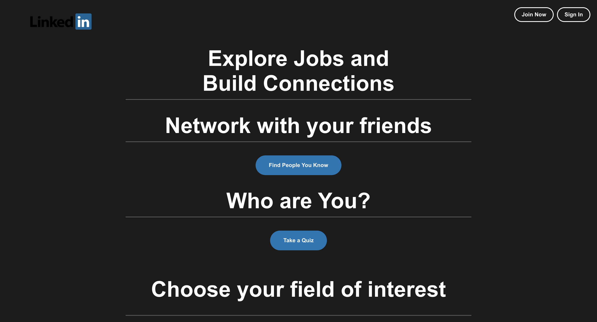

# LinkHub
A Full-Stack Project that has core LinkedIn features such as user authentication, job postings, user feeds, and company profiles.
## License
This project is for **viewing purposes only**.  
Do not copy, modify, or redistribute any part of this code without explicit permission.  
© 2025 Tony Akinyemi. All rights reserved.

## Description
The user flow for this project is that the user either creates an account or logins to an existing one, they see post on their user feed and they also have the ability to look all the jobs posted recently to last on their user feed. Google Gemini was used for the CSS design of this application to create a user-friendly experience where the UI of this application is able to run on tablets, phones, laptops, and desktops. This design choice was made because it was impractical to test the UI of this project across hundreds of different screens and many different browsers.

## Features

# Screenshots

## Tech-stack
- Frontend: React
- Backend: FasAPI
- Database: PostgreSQL

## Live Demo
- [Live Site](https://delicate-starburst-7bb860.netlify.app/)

